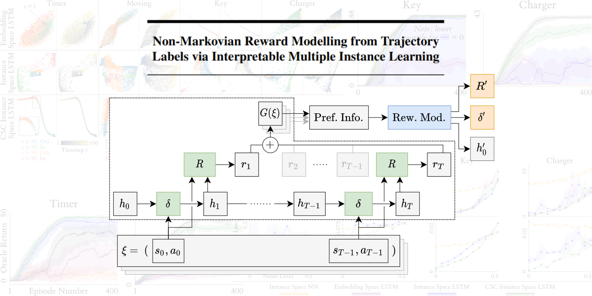

# Non-Markovian Reward Modelling from Trajectory Labels via Interpretable Multiple Instance Learning

This repo contains the code for the paper [Non-Markovian Reward Modelling from Trajectory
Labels via Interpretable Multiple Instance Learning](https://arxiv.org/abs/2205.15367). We use [Bonfire](https://github.com/JAEarly/Bonfire) for the
backend MIL functionality.

Below we break down each of the directories in this repo:

### Data

Contains all of our data files. For each task, we used an oracle to generate a dataset, stored as a `.csv` file.
`datasets.yaml` defines the `csv` path for each dataset. Certain datasets also have a metadata file contains additional
(computer readable) information about each dataset (used to speed up dataset loading times). For the lunar lander
experiments, the data is provided from an external file store due to large file sizes. Please see
`data/oracle/lunar_lander/README.md` for more information.

### Lib

Contains small additional libraries used in our work. These libraries are personal implementations of helper
functionality, i.e., they are not fully released public libraries, but are also not specific to this project. The
libraries are used for plotting, reinforcement learning utility functions, and the base reinforcement learning
environments.

### Models

Contains all of our trained model. Each model file is contains the model weights as saved by PyTorch as a `.pkl` file.
Normal models are named `<dataset_name>_<model_name>_<repeat>.pkl`, and noisy models (trained against datasets with swapped
labels), are named `<dataset_name>_<model_name>_<noise_level>_<repeat>.pkl`

### Out

Contains all the outputs that are not model files. Figures can be found in the `fig` directory; the majority are `.png`
files, but some are saved as `.svg`.

### Results

Contains all of our results. The `rl`, `rl_noisy`, and `synthetic` folders contain the results of training the MIL
models (saved as `.txt` files containing human-readable results table but also Latex code for those tables). `rl_training` contains
time series (`.csv` files) of per-episode oracle returns for all RL training runs documented in the paper (`emb` = Embedding Space LSTM,
`ins` = Instance Space LSTM, `csc` = CSC Instance Space LSTM).

### Scripts

Contains our executable scripts. These are the entry points to our experiments, and should be run from the root
of the repo. Important scripts include: `train_model.py`, `eval_models.py`, `generate/make_synthetic_oracle_dataset.py`
, `scripts/plot_interpretability.py`, and `rl/run_rl_with_wrapper.py`. The libraries required for running these scripts can be
found in `requirements.txt`.

### Src

Contains our project-specific code. This includes the dataset and oracle implementations, high-level model implementations
(low-level model code is implemented in Bonfire), oracle reward functions (all of which inherit from an abstract base class),
the environment wrapper for RL training, visual descriptions of the per-task environment layouts for rendering, and
interpretability studies (e.g., probes).
